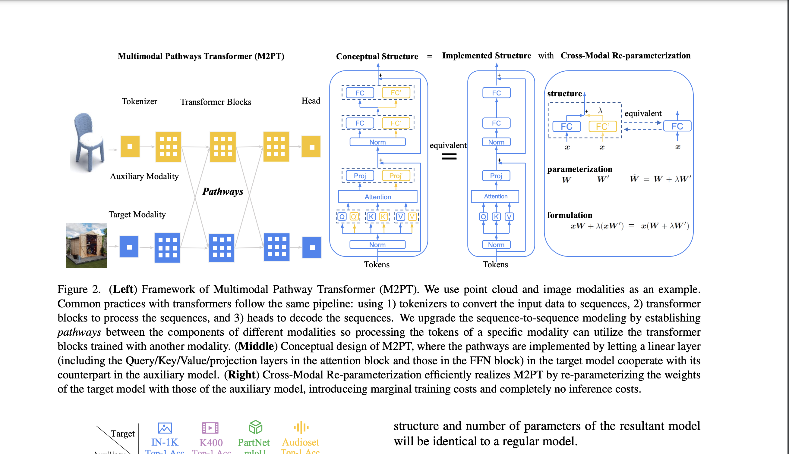

[](https://discord.gg/qUtxnK2NMf)

# Multi-Modal Pathway Transformer



Implementation of M2PT in PyTorch from the paper: "Multimodal Pathway: Improve Transformers with Irrelevant Data from Other Modalities".  [PAPER LINK](https://arxiv.org/abs/2401.14405). This is really really cool because just by merging the projections of different multi-modal models together you can increase the performance of your base model.


## Install
`pip3 install -U m2pt`

## Usage

### `MPTransformerBlock`

- Implementation of Figure 2 and the Multimodal Pathway Transformer

- Re-Usable and Modular.

- Combines linear projections from multiple models


```python
import torch
from torch import nn
from m2pt import MPTransformerBlock

# Create an instance of the MPTransformerBlock class with the specified parameters
model = MPTransformerBlock(
    dim=512,  # Dimension of the input and output tensors
    dim_head=64,  # Dimension of each attention head
    heads=8,  # Number of attention heads
    dropout=0.1,  # Dropout rate
    ff_mult=4,  # Multiplier for the dimension of the feed-forward network
    original_linear=nn.Linear(512, 512),  # Linear layer for the original input tensor
    auxiliar_linear=nn.Linear(512, 512),  # Linear layer for the auxiliary input tensor
    ffn_original_linear=nn.Linear,  # Linear layer for the original input tensor in the feed-forward network
    ffn_auxiliar_linear=nn.Linear,  # Linear layer for the auxiliary input tensor in the feed-forward network
    ffn_original_last_linear=nn.Linear,  # Last linear layer for the original input tensor in the feed-forward network
    ffn_aux_last_linear=nn.Linear,  # Last linear layer for the auxiliary input tensor in the feed-forward network
)

# Create a 3D tensor with shape B x S x D
x = torch.randn(1, 512, 512)

# Pass the input tensor through the model
out = model(x)

# Print the shape of the output tensor
print(out.shape)


```


### `CrossModalReparameterization`
- Implementation of the Cross Modal Reparameterization from the paper in Figure 2 and section 3.2

- It combines the linear methods of different multi-modal models and kinda merges them through addition and a constant value lambda or Cross Modal Scale

- Modular & Re-usable: Simply plug in your linears from any models!

```python
import torch

import torch.nn as nn

from transformers import BertModel, BertConfig, ViTModel, ViTConfig

from m2pt import CrossModalReparameterization

# Define a simple Transformer model for text
class TextTransformerModel(nn.Module):
    def __init__(self, bert_model_name='bert-base-uncased'):
        super(TextTransformerModel, self).__init__()
        self.bert = BertModel.from_pretrained(bert_model_name)

        # Assume we're reparameterizing the first linear layer of the classifier
        self.classifier = nn.Linear(self.bert.config.hidden_size, 2)

    def forward(self, input_ids, attention_mask):
        outputs = self.bert(input_ids=input_ids, attention_mask=attention_mask)
        pooled_output = outputs.pooler_output
        logits = self.classifier(pooled_output)
        return logits

# Define a simple Transformer model for images (using ViT for example)
class ImageTransformerModel(nn.Module):
    def __init__(self, vit_model_name='google/vit-base-patch16-224'):
        super(ImageTransformerModel, self).__init__()
        self.vit = ViTModel.from_pretrained(vit_model_name)

        # Assume we're using the first linear layer of the classifier as the auxiliary layer
        self.classifier = nn.Linear(self.vit.config.hidden_size, 2)

    def forward(self, pixel_values):
        outputs = self.vit(pixel_values=pixel_values)
        pooled_output = outputs.pooler_output
        logits = self.classifier(pooled_output)
        return logits

# Example usage
# Initialize both models
text_model = TextTransformerModel()
image_model = ImageTransformerModel()

# Assume we want to reparameterize the classifier layer of the text model
# using the classifier layer of the image model
cross_modal_layer = CrossModalReparameterization(text_model.classifier, image_model.classifier)

# Replace the classifier in the text model with the cross-modal layer
text_model.classifier = cross_modal_layer

# Example input (batch_size, sequence_length)
input_ids = torch.randint(0, 1000, (8, 512))
attention_mask = torch.ones(8, 512)

# Forward pass through the reparameterized model
logits = text_model(input_ids, attention_mask)
print(logits)

# Train the text model as usual...

# After training, merge the parameters for inference
text_model.classifier.merge_parameters()


```


## Citation
```bibtex
@misc{zhang2024multimodal,
    title={Multimodal Pathway: Improve Transformers with Irrelevant Data from Other Modalities}, 
    author={Yiyuan Zhang and Xiaohan Ding and Kaixiong Gong and Yixiao Ge and Ying Shan and Xiangyu Yue},
    year={2024},
    eprint={2401.14405},
    archivePrefix={arXiv},
    primaryClass={cs.CV}
}
```


# License
MIT
